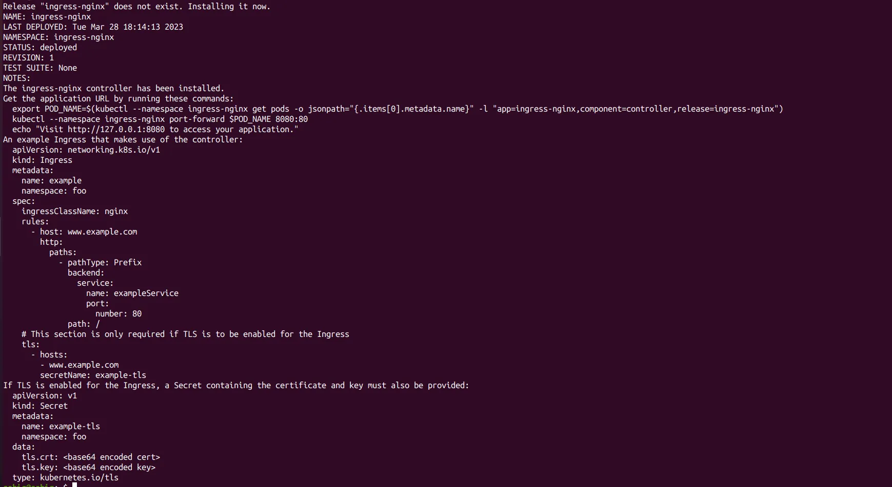

# ticketing

<h2>Install nginx ingress on GKE:</h2>

GKE has helm installed already

helm repo add ingress-nginx https://kubernetes.github.io/ingress-nginx

helm repo update

Since we are deploying nginx ingress using helm charts, we have to create a values.yamlfile 
to override the default configuration. let’s create it values.yamland keep the below content in this.

<strong>Deploying Nginx ingress controller with default ingress class nginxand service type ClusterIP with NEG annotation</strong>

helm upgrade --install -f values.yaml ingress-nginx ingress-nginx --repo https://kubernetes.github.io/ingress-nginx --namespace ingress-nginx --create-namespace

Command output should look like this:

 

